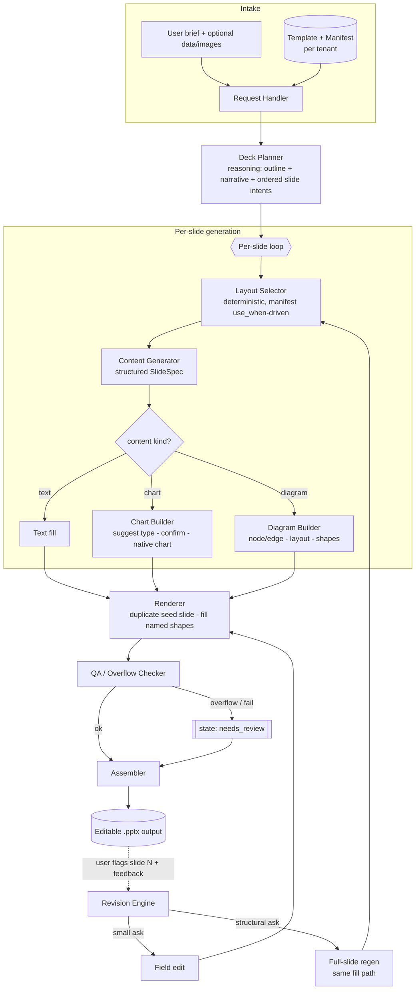

# System Design Document
### Presentation Automation Engine ("Deck Engine")

| | |
|---|---|
| **Document** | 2 of 3 — System Design Document (SDD) |
| **Version** | 1.0 |
| **Status** | v1.6 — S1 + S2 validated; M0–M4 built, verified end-to-end (M3 charts + M4 diagrams, both native + editable) |
| **Owner** | Prit (AI Engineer) |
| **Related docs** | `01_technical_spike_plan.md`, `03_product_requirements_document.md` |
| **Audience** | Implementation (Claude Code) + engineering review |

> **Read order:** the spike (Doc 1) validates the bets this design assumes. Some decisions below are marked *(spike-gated)* — if the corresponding experiment fails, apply the fallback named in Doc 1 §7.
>
> **v1.1 change note:** the real reference template + manifest (uploaded) use a **seed-slide-duplication** rendering mechanic — real slides holding named shapes, duplicated and filled — rather than the "PowerPoint Slide Layouts + `placeholders` collection" mechanic assumed in v1.0. This is a valid, in some ways simpler, `python-pptx` pattern. Sections §3 (D2/D3/D5/D8), §5.1/5.7/5.8/5.11, and §6 are updated accordingly; everything else is unchanged.
>
> **v1.2 change note:** building M1 surfaced that D6's "structured outputs + Pydantic + bounded retry" contract is naturally **provider-agnostic** — only the wire mechanism for forcing/constraining JSON output differs between vendors. The Content Generator (5.5) was implemented behind a swappable `llm_providers` layer: `claude-sonnet-5` (Anthropic) remains the **reference model/provider** (per S2's validated result), with local **Ollama** and **Gemini** wired in as supported alternatives for offline/local dev or when only a non-Anthropic credential is available. Section §5.5 and §8 are updated accordingly; the D6 decision itself is unchanged, just clarified as provider-agnostic by construction.
>
> **v1.3 change note:** M2 built the Deck Planner (5.3) + Layout Selector (5.4) across the full 8-layout set. One deliberate scope decision made during implementation, not previously called out in this doc: `title` and `closing_contact` stay **fixed, code-guaranteed bookends** (every deck opens/closes with them, unconditionally) rather than becoming part of what the Planner decides — the manifest's own `use_when` text ("Opening slide of any deck" / "Final slide") already says these aren't narrative choices. The Planner only plans the 6 layouts in between. Layouts needing an exhibit (`two_column`, `image_only`, `exhibit_data`) can already be selected and text-filled; their image slot is left as the seed's grey placeholder and the slide is flagged `needs_review` until the Chart Builder (5.6, M3) / Diagram Builder (5.7, M4) exist to supply it — this is D9's flag-don't-guess principle applied to a whole build phase, not just a runtime error. Sections §3 (D5), §5.3/5.4/5.8, and §9 are updated accordingly.
>
> **v1.4 change note:** the first genuinely successful M2 end-to-end run (brief → title → planned content slides → rendered `.pptx`) completed via `--provider gemini`, producing a 4-slide deck (`title` → `exhibit_data` → `quote_callout` → `closing_contact`) verified by reopening in real PowerPoint (no repair prompt) and inspecting exported slide images. This run surfaced a genuine bug in the CLI's bookend handling, now fixed: when the title slide's content failed business-rule validation on **both** the initial attempt and the bounded retry (D6) — observed case: a subtitle one character over `max_chars` — `cli.py` was silently **dropping the title slide entirely** rather than rendering it, because it only rendered when `generate_single_slide` returned a non-`None` spec. This is worse than the D9 failure mode it was trying to avoid: a slightly-over-length title is cosmetic, a missing opening slide is structural, and it directly contradicted the v1.3 "fixed, code-guaranteed bookend" guarantee. Fixed by having the CLI construct a best-effort `SlideSpec` from the failed attempt's raw slot values for `title` specifically when both attempts fail validation — still flagged `needs_review`, but never dropped. §5.8 and §9 are updated accordingly; local Ollama (26B, CPU-only) remains unreliable for M2's larger schemas (JSON truncation on longer structured-output responses) and is not yet a proven path for a full M2 run — Gemini and Anthropic are.
>
> **v1.5 change note:** M3 built the Chart Builder (5.6, `chart_builder.py`) + the renderer's native-chart path (5.8 point 5). Exhibit slots the Planner marks `needs_exhibit=chart` now render a **real, editable `python-pptx` chart** (`add_chart` + `CategoryChartData`), not a picture — verified end-to-end via `--provider gemini` (a `LINE_MARKERS` chart of Q1–Q4 revenue, opened clean in PowerPoint, chart data intact and editable). Type selection is **deterministic** (no LLM): a fixed data-shape→type table (multi-series→column, single time series→line, single share→pie, else→column) suggests a supported type with a one-line reason; the user confirms/overrides (`--confirm-charts`, a per-chart `type`, or `--chart-type`). D7 is enforced in one place (`models/chart.SUPPORTED_CHART_TYPES`): only the six categorical-data types (column/bar/line/pie/doughnut/area) are offered, and an override naming an exotic/unsupported type (waterfall, funnel, treemap, …) is **remapped to the nearest supported one with an explanation**, never silently honored into a broken chart. Chart *data* is never fabricated (5.6/D9) — it comes from the caller via `--chart-data`; a chart-needing slide with no data supplied keeps its placeholder and is flagged `needs_review`. Scatter/bubble/stock, which D7 names "if needed," are deliberately deferred: they need an XY/OHLC data model rather than categories+series, so offering them from categorical data would build broken charts. Sections §3 (D7), §5.6/5.8, and §9 are updated accordingly.
>
> **v1.5 robustness note (found during M3 stress-testing):** a large multi-chart brief via `--provider gemini` hit a raw `ConnectionResetError` ("forcibly closed by the remote host", WinError 10054) mid-run, which escaped `_http_post_json` as an unhandled traceback — the same class of bug as the earlier uncaught `TimeoutError`, since a socket reset is an `OSError`, not a `urllib.error.URLError`. Fixed by broadening the wrap to `(URLError, TimeoutError, OSError, http.client.HTTPException)` and adding a **bounded retry with linear backoff** for transient failures (429/5xx and all network-level errors), so a transient blip no longer either crashes the run or fails it outright. Permanent errors (HTTP 400/401/404) still raise immediately without wasting retries. This is the D9 "clean, flaggable failure, never a raw crash" discipline applied to the whole HTTP provider layer (Ollama + Gemini).

> **v1.6 change note:** M4 built the Diagram Builder (5.7, `diagram_builder.py` + `models/diagram.py`) + the renderer's native-diagram path (`_add_native_diagram`). Three deliberate narrowings of the original 5.7 concept, decided at milestone time (not silent drift): **(a) no LLM anywhere in the diagram path** — the SDD originally had an LLM extract a node/edge spec from prose; instead, ordered step labels are **caller-supplied** via `--diagram-data` (the exact twin of `--chart-data`'s cursor-mapped, planner-order wiring), never fabricated (D9). An LLM/agent can supply this same `DiagramData` contract in v2 without the renderer changing — the boundary was designed for that hand-off. **(b) Linear-only, no single-branch** — a branch point is a genuine judgement call that only an LLM/agent (or explicit user input) should make; deferred rather than half-built. **(c) Chevron-flow visual, no image-fallback** — a row of `MSO_SHAPE.CHEVRON` autoshapes (each shape's own arrow implies "next step"; no connector API involved), grouped via `add_group_shape` into ONE group renamed to the slot's `shape_name` (D3 — the slot stays addressable as a single shape, exactly as `_add_native_chart` renames its graphic frame) while each chevron inside stays individually editable. With steps bounded 2–6 and labels ≤24 chars (`models/diagram.py`), "too complex to lay out" — the failure D8 kept an image-fallback for — is now simply a validation error at data-parse time; the S5 spike question and its fallback are **moot for v1**, resolving SDD open question #3. `manifest.brand.colors` is now threaded through `render_slide` → `fill_slot` → `_add_native_diagram` (chevrons render in the tenant's `blue_primary`), the first component to consume brand colors at render time. Verified end-to-end: a 6-step (worst-case) chevron flow rendered into `image_only`'s `IM_IMAGEONLY_HERO`, saved, reopened clean — group name, step order, brand fill, and computed geometry all intact. Sections §3 (D8), §5.7/5.8, and §9 are updated accordingly.

---

## 1. Overview

The Deck Engine turns a plain-language brief into a **native, fully-editable `.pptx`** rendered onto a customer's branded template. It is built on a single architectural thesis:

> **A deck has two layers that fail for different reasons.** The **reasoning layer** (narrative, structure, copy, chart-type choice) is where LLMs are strong. The **rendering layer** (brand-compliant layout, theme, exhibits) must be **deterministic**. The engine keeps these separate and connects them through one contract: a structured **SlideSpec**.

**Product framing:** the engine is **tenant-agnostic**. Branding lives entirely in a swappable template + manifest, never in the code. A single reference tenant is onboarded first (for dogfooding); additional firms onboard by having a built-to-spec template + manifest prepared for them. Arbitrary "upload any existing deck" ingestion is explicitly **out of v1**.

---

## 2. Goals & non-goals (v1)

**Goals**
- Brief → editable `.pptx` on a tenant's branded template, unattended.
- Content types: **text, charts** (LLM suggests type from data shape, user confirms), **one diagram type** (process/flow) as editable native shapes.
- **Per-slide** revision: field-level edit + full-slide regeneration, with accumulating feedback.
- Style consistency guaranteed **structurally** (theme inherited from template), not by prompting.
- Multi-tenant-**ready** architecture (per-tenant template + manifest, isolated state).

**Non-goals (v1)** — deferred to roadmap (see PRD §9)
- Arbitrary-template ingestion / auto-manifest generation.
- Self-serve template-builder wizard.
- Exotic consulting charts (waterfall, mekko, funnel, Gantt).
- Confidentiality / compliance controls beyond a zero-retention API default.
- Real-time collaboration, animations, embedded video.

---

## 3. Key architectural decisions

The rationale matters more than the rule — record it so future changes are made with eyes open.

| # | Decision | Rationale | When to revisit |
|---|---|---|---|
| **D1** | **Orchestrator + tools**, not a true multi-agent mesh. One controller makes structured calls to specialized functions (layout selector, content generator, chart builder, diagram builder, renderer). | For a linear pipeline, an orchestrator with typed tool calls is cheaper, more debuggable, and more reliable than autonomous agents handing off to each other. Multi-agent earns its complexity only when sub-tasks need independent context or parallel iteration. | If a stage needs genuine independent, iterative reasoning (e.g., a research sub-agent), promote *that* stage to a sub-agent — not the whole system. |
| **D2** | The template is a **`.pptx` built to spec**, not a `.potx`. | `python-pptx` has no template concept — it only knows presentations. `.potx` is a PowerPoint-client construct with no engine benefit. | If the rendering library changes. |
| **D3** | **Layouts are "seed slides,"** not PowerPoint Slide Layouts. Each manifest layout maps to one real, pre-built slide (by `slide_index`) inside the template `.pptx`, carrying uniquely-named shapes (e.g. `IM_TITLE_DECKTITLE`). The engine **duplicates that seed slide** (XML-clone) and fills its named shapes — it never calls `add_slide(slide_layout)` and never touches the `placeholders` collection. | Confirmed against the real reference template: all 9 slides sit on the same generic `Blank` PowerPoint layout; the real per-slide-type structure lives in hand-placed, hand-named shapes, not in distinct Slide Layouts. This is *simpler to author* (no Slide Master surgery) and *sidesteps* the "can't add layouts at runtime" constraint entirely — you never need a new layout, only a fresh copy of an existing seed slide. | Never — this is now the confirmed, real mechanic (supersedes the v1.0 assumption). |
| **D4** | A **manifest** (JSON) is the machine-readable contract describing each seed slide's shapes. Authored **manually** in v1. | The `.pptx` carries only visual structure; it has no way to tell an agent "the shape named `IM_TITLE_DECKTITLE` is the deck title, max 70 chars" or "use `two_column` for narrative-plus-visual." The manifest is that missing metadata layer. Manual authoring sidesteps the hard, unreliable problem of inferring structure from a file. | Auto-draft tool is a v2 item (review-then-correct, not unsupervised). |
| **D5** | **Layout (seed-slide) selection is deterministic from the manifest's `use_when` field** (optionally LLM-*assisted*), **not vision-based.** **Implemented in M2** (`layout_selector.py`) as: validate the Deck Planner's `suggested_layout` hint against the real manifest first (never trust an LLM string blindly, even enum-constrained) — only if that's missing/invalid does a cheap LLM tiebreak run (reusing whichever provider/model is already configured, not a separate hardcoded tier), and only if *that* also fails does it default to `text_bullets` + flag. `title`/`closing_contact` are excluded from what's ever selectable this way — they're fixed bookends (5.5), not planned. | Each seed slide's purpose and shapes are known metadata — re-deriving them by having a vision model look at a rendered slide is slow, costly, and non-deterministic. | Never for selection. Vision is reserved for QA (D9). |
| **D6** | **Structured outputs** (tool-use forcing or JSON-schema mode) + **Pydantic** validation + **bounded retry** for every SlideSpec. **Provider-agnostic by construction** (v1.2): a swappable `llm_providers` layer implements this same contract against Anthropic, Ollama, and Gemini — only the wire mechanism for forcing/constraining JSON differs. | Tool-use structured output is ~99.8% schema-valid; Pydantic enforces business rules on top; a single validation-error-fed retry closes the rest. Eliminates fragile JSON parsing. Provider-swappability costs little (the contract was already provider-shaped) and buys local/offline dev (Ollama, no credential) and a fallback if a single vendor has an outage or credential issue. | If a future API makes this native/simpler. `claude-sonnet-5` stays the reference/default provider — S2 validated *it*, specifically, not the contract in the abstract (spike `FINDINGS.md`). |
| **D7** | **Chart-type support matrix.** Native charts for **column/bar, line, pie, doughnut, area** (and scatter/radar/bubble/stock if needed). Exotic charts are **out of v1**. The suggestion engine only offers **supported** types. **Implemented in M3** (`chart_builder.py` + `models/chart.SUPPORTED_CHART_TYPES`): the matrix lives in one place; the deterministic suggester only emits from it; an override naming an exotic type is remapped to the nearest supported one with an explanation. Scatter/bubble/stock deferred (they need an XY/OHLC data model, not categories+series). | `python-pptx` natively supports these; it has **no** native waterfall/mekko/funnel/Gantt/treemap. Offering unsupported types would produce failures or force an image fallback. | Exotic charts arrive in v2 as **shape-composition** components (editable rectangles+lines), not native charts. |
| **D8** | **Diagrams as editable native shapes** via deterministic layout of caller-supplied step labels. **Implemented in M4** (narrowed, v1.6): no LLM node/edge extraction — steps come from the caller (`--diagram-data`, D9), linear chevron-flow only, grouped into one manifest-named shape (D3). | Editable native `.pptx` is a hard product requirement; Mermaid→image yields a flat, non-editable picture. Native-shape composition + our own layout logic is the only editable path. With bounded 2–6 steps there is no "too complex" case left, so the S5 image-fallback is moot for v1. | Branching/complex diagrams (org charts, swimlanes) → v2, when an LLM/agent can supply the branch structure through the same `DiagramData`-style contract. |
| **D9** | **Overflow handling = prevention + detection + review gate.** Schema `maxLength` per field (prevention) → post-render height measurement (detection) → `needs_review` state (gate). Never a silent bad slide. *(spike-gated: S3)* | Text does not auto-shrink in PowerPoint the way it does on the web; unmanaged overflow silently produces broken slides — the worst failure a user can hit. | If auto-fit logic proves reliable later, add auto-shrink as an option before the review gate. |
| **D10** | **Regeneration reuses the exact same layout-fill code path as generation.** Field-edit vs. full-regen is chosen by **intent-classifying the user's feedback**. | Because every slide is an instance of a *locked* layout, theme/colors are inherited automatically — so "regenerated slide looks out of nowhere" is **structurally impossible** as long as regen calls the same fill function. One code path, not two. | Never — this is a core invariant. |
| **D11** | **One rendering function** serves both full-deck generation and single-slide regeneration (called in a loop, or once). | Prevents drift between two code paths and guarantees D10's consistency invariant. | Never. |
| **D12** | **Zero-data-retention API calls as the default.** | Even though broader confidentiality is deferred, ZDR is near-zero-cost hygiene and this pipeline processes PE/client content. Cheap to set now, expensive to retrofit trust later. | Full confidentiality/compliance controls are a v2 workstream. |
| **D13** | **Duplicate-then-fill ordering, always.** For image/exhibit shapes: duplicate the **pristine seed slide first**, *then* insert the real picture/chart into the duplicate and remove its grey placeholder rect. Never duplicate a slide that already has a picture inserted; regeneration always re-duplicates fresh from the pristine seed (never clones an already-rendered output slide). | `python-pptx` slide duplication is done via XML-cloning (`copy.deepcopy` of the slide element), which has a known issue losing embedded-image relationships when a slide *already containing* a real picture is cloned again. Duplicating the empty/placeholder version first, then inserting the image, sidesteps this entirely. | Never — this is a correctness invariant for the seed-slide mechanic (D3). |

---

## 4. High-level architecture



**Flow in prose:** a brief plus the tenant's template/manifest enters the Request Handler. The **Deck Planner** (the reasoning step) produces the deck's *bones* — an ordered list of slide intents with narrative. For each slide, the **Layout Selector** picks a seed slide deterministically from the manifest's `use_when` field; the **Content Generator** emits a validated **SlideSpec**; depending on content kind, a **Chart** or **Diagram** builder produces its exhibit; the **Renderer** duplicates the chosen seed slide and fills its named shapes. The **QA/Overflow Checker** either passes the slide or marks it `needs_review`. The **Assembler** emits one editable `.pptx`. Later, a user can flag any slide with feedback; the **Revision Engine** routes it to a surgical field-edit or a full-slide regeneration — the latter re-duplicating the same pristine seed slide so brand consistency holds automatically.

---

## 5. Components

Each component lists its responsibility, inputs, outputs, core logic, and primary failure mode.

### 5.1 Template Registry & Manifest Loader
- **Responsibility:** resolve the active tenant's template `.pptx` + manifest; validate the manifest against the template (every manifest seed slide `slide_index` exists in the file, and every named shape it lists is actually present on that slide).
- **In:** `tenant_id`. **Out:** validated `Template` + `Manifest` objects.
- **Core logic:** load `.pptx`; for each manifest layout, confirm `slide_index` < slide count and that every `shape_name` in its `slots` matches a real `shape.name` on that slide; fail fast on any mismatch.
- **Failure mode:** manifest drift (manifest describes a `slide_index` or `shape_name` the template lacks) → hard error at load, never at render.

### 5.2 Request Handler / Intake
- **Responsibility:** accept a brief (+ optional structured data for charts, +optional user images), attach tenant context, create a `Deck` record.
- **In:** brief, tenant_id, optional data/images. **Out:** `Deck` (empty, `status=planning`).

### 5.3 Deck Planner  *(reasoning)* — **built, M2** (`deck_planner.py`)
- **Responsibility:** turn the brief into an **ordered list of slide intents** — the deck skeleton (sections, how many slides, each slide's job and headline), not final copy.
- **In:** brief + manifest (so it knows which layout *kinds* exist). **Out:** `list[SlideIntent]`.
- **Core logic:** structured-output call (D6). Emits, per intended slide: `purpose`, `suggested_layout`, `headline`, `content_outline`, `needs_exhibit` (none|chart|diagram). **Scope decision (v1.3):** only offered the 6 non-bookend layouts (`section_divider`, `text_bullets`, `image_only`, `two_column`, `exhibit_data`, `quote_callout`) — `title`/`closing_contact` are fixed bookends the CLI always adds, never something the Planner is asked to decide.
- **Failure mode:** over/under-planning slide count → capped via schema `minItems`/`maxItems` (CLI's `--min-slides`/`--max-slides`); malformed individual intents are dropped, not fatal, as long as at least one usable intent survives; total planning failure → one bounded retry (D6), then a hard, flagged error (never a silent zero-slide deck).

### 5.4 Layout Selector — **built, M2** (`layout_selector.py`)
- **Responsibility:** map each `SlideIntent` to a concrete manifest seed slide (`layout_id` / `slide_index`).
- **In:** `SlideIntent` + manifest. **Out:** `layout_id`.
- **Core logic:** deterministic rules from each layout's `use_when` field; the Planner's `suggested_layout` is a hint, validated against the manifest (never trusted blindly). Optional tiebreaker for ambiguous cases (reuses whichever provider/model the run is already using, rather than a hardcoded cheap tier — a possible future refinement, not a correctness requirement).
- **Failure mode:** no clean match → default to a safe general layout (`text_bullets`) and flag.

### 5.5 Content Generator  *(the text agent)*
- **Responsibility:** produce a validated **SlideSpec** — the values for each named shape/slot on the chosen seed slide.
- **In:** `SlideIntent`, chosen layout (with its slot `shape_name`s + `max_chars`/`max_items`), deck context (title, surrounding headlines), tenant voice guide. **Out:** `SlideSpec`.
- **Core logic:** structured output constrained to the layout's exact slot names; `max_chars`/`max_items` per slot from the manifest (D9 prevention); Pydantic validation + one retry (D6).
- **Provider (v1.2):** the structured-output call goes through `llm_providers.call_structured(provider, model, ...)`, not a hardcoded Anthropic client. **`claude-sonnet-5` (Anthropic) is the reference/default provider** — it's the one S2 actually validated (spike `FINDINGS.md`: 100% schema-valid, 100% usable, N=20). **Ollama** (local, no credential — tool-use analog is a JSON-schema-constrained `format` parameter) and **Gemini** (`responseSchema` + `responseMimeType=application/json`) are supported alternatives, selectable per-run (e.g. the M1 CLI's `--provider`/`--model` flags), not per-tenant config — swapping is an operational/dev choice, not a product one. Dogfood run against Ollama's `gemma4:latest` (8B) surfaced a real content-quality gap smaller models have that Claude didn't (echoing a slot's *description* back as its *value* instead of writing real content) — expected, not a pipeline defect; reinforces that provider choice is a reliability/quality tradeoff the SDD should not paper over.
- **Failure mode:** invalid/over-length after retry → `needs_review`. A malformed top-level response (e.g. an array-typed field returned double-encoded as a JSON string — observed against `claude-sonnet-5` itself, not just smaller models) gets the same bounded-retry-then-flag treatment, not a silent empty result (D9).

### 5.6 Chart Builder — **built, M3** (`chart_builder.py`)
- **Responsibility:** from data, **suggest** a chart type, get user confirmation, build a **native** chart.
- **In:** structured data (+ optional user-specified type). **Out:** a `ChartSpec` (confirmed supported type + data) the renderer turns into a native chart.
- **Core logic:** deterministic **shape→type** table (no LLM — picking a chart type from a data shape is a lookup, not a judgement) — multi-series comparison → clustered column; single series over a time-like axis → line; single series flagged part-of-whole (`kind="share"`) → pie; otherwise categorical → column. Suggest with a one-line reason + a menu of supported alternatives; the user confirms/overrides (CLI `--confirm-charts` interactive prompt, a per-chart `type` in the data, or a global `--chart-type`). The renderer builds via `add_chart` + `CategoryChartData` (5.8 point 5). **Only supported types offered** (D7), enforced in one place: `models/chart.SUPPORTED_CHART_TYPES` = column/bar/line/pie/doughnut/area (the categorical-data types `CategoryChartData` builds correctly). Scatter/bubble/stock (D7's "if needed") are deferred — they need an XY/OHLC data model, out of M3 scope.
- **Failure mode:** requested unsupported/exotic type → **remap to nearest supported + explain** (`nearest_supported_type`, e.g. waterfall→column, funnel→bar, treemap→pie), never a broken chart, never a hard reject; missing data → the caller must supply it via `--chart-data` (5.6/D9 — `ChartData` won't even validate without categories + at least one series, so nothing is ever fabricated), and a chart-needing slide with no data keeps its placeholder + `needs_review` flag.

### 5.7 Diagram Builder — **built, M4** (`diagram_builder.py`, narrowed per v1.6)
- **Responsibility:** from caller-supplied ordered step labels, build a **linear chevron-flow** diagram as editable native shapes.
- **In:** ordered step labels (CLI `--diagram-data`, mapped in planner order to `needs_exhibit=diagram` slides — the exact twin of chart data's wiring). **Out:** a validated `DiagramData` the renderer turns into a grouped row of chevron autoshapes.
- **Core logic:** **fully deterministic, no LLM** (v1.6 narrowing — the original "LLM emits a node/edge spec from prose" idea is deferred to v2, where an agent can supply the same contract): `models/diagram.DiagramData` validates 2–6 non-blank steps of ≤24 chars each; the renderer's `_add_native_diagram` computes chevron geometry from the slot's `geometry_in` (equal widths, fixed gaps, vertically centered), draws one `MSO_SHAPE.CHEVRON` per step in the tenant's `blue_primary`, groups them (`add_group_shape`) and renames the group to the slot's `shape_name` (D3). `diagram_builder.build_diagram_data` is deliberately a thin validate-and-wrap — with exactly one diagram type there is no classify/suggest/resolve decision to make (unlike chart's 6-type matrix); the module exists as the structural growth point for a v2 second type.
- **Failure mode:** invalid steps (too few/many, blank, over-length) → block rejected at parse with a printed flag, slide keeps its placeholder + `needs_review` (D9); no data supplied → same placeholder + flag; **no image-fallback path exists or is needed** — bounded input means there is no "too complex to lay out" case (S5 and SDD open question #3: moot for v1). Branching/complex diagrams → v2.

### 5.8 Renderer  *(the fill engine — deterministic)*
- **Responsibility:** given a chosen seed slide (`layout_id`) + SlideSpec (+ any chart/diagram instruction), produce a filled slide in the output deck.
- **In:** open `Presentation` (loaded from the pristine template), `layout_id` → `slide_index`, `SlideSpec`, exhibit instructions. **Out:** a new, filled slide appended to the *output* presentation.
- **Core logic (seed-slide duplication, per D3/D13):**
  1. Locate the pristine seed slide at `manifest.layouts[layout_id].slide_index` in the **template** file (never in a previously-generated output).
  2. **Duplicate it** via XML-clone (`copy.deepcopy(slide._element)`, inserted into the output presentation's `slides._sldIdLst`) — while the slide is still in its clean, placeholder-only state.
  3. On the **duplicate**, find each shape by `shape.name == slot.shape_name` and write per the manifest's `fill_protocol`: `text` → set run text; `bullets` → one paragraph per item (respecting `max_items`/`max_chars_per_item`); `image` → insert the picture at the slot's `geometry_in`, then remove the grey placeholder rect.
  4. Never add unnamed shapes; never rename existing ones (manifest's own protocol, now enforced by the renderer).
  5. **Exhibit slots typed `image`** (e.g. `IM_EXHIBIT_VISUAL`) can be filled two ways per D7: insert a rendered chart image, or — preferred, since it stays editable — add a **native** `python-pptx` chart (`add_chart` + `CategoryChartData`) positioned at the slot's `geometry_in`, then discard the grey placeholder rect. **Built in M3** (`_add_native_chart` in `renderer.py`): `render_slide(..., chart_specs={shape_name: ChartSpec})` routes a chart spec to the native path (which takes precedence over a picture `image_source_path` for the same slot), resolves the type through `SUPPORTED_CHART_TYPES` (so nothing outside D7 can reach `add_chart`), and renames the inserted graphic frame back to the slot's `shape_name` so it stays addressable (D3). Tables, if used, are added via `shapes.add_table` (`python-pptx` cannot write into a table *placeholder* — none exist here anyway, since this template uses plain shapes).
- **Failure mode:** named shape not found (should be caught by 5.1) → hard error; **inserting an image into a slide *before* duplicating it** risks the known embedded-image-loss issue on subsequent clones — the renderer must always duplicate first, fill second (D13). **Image slot with no source available (v1.3, M2):** e.g. a selected `two_column`/`image_only`/`exhibit_data` slide before the Chart Builder (5.6, M3) / Diagram Builder (5.7, M4) exist to supply the picture — the renderer does **not** raise; it leaves the seed's grey placeholder rect in place and reports the skipped slot back to the caller to flag `needs_review` (D9). A crash here would be worse than an honestly-incomplete, flagged slide.

### 5.9 QA / Overflow Checker  *(spike-gated: S3)*
- **Responsibility:** verify each rendered slide before it's accepted.
- **In:** rendered slide + SlideSpec. **Out:** `ok` or `needs_review` (+ reason).
- **Core logic:** measure text height vs. placeholder height (overflow); optional **post-assembly snapshot + vision check** for misalignment/off-brand (this is the *only* sanctioned vision use — QA, never selection/placement, per D5).
- **Failure mode:** false positives acceptable (route to review); false negatives are the risk to minimize.

### 5.10 Revision Engine
- **Responsibility:** apply user feedback to a single slide without disturbing others.
- **In:** `slide_id`, `feedback_text`. **Out:** updated slide.
- **Core logic:**
  - **Intent-classify** the feedback → *small ask* (change a value/word) → **field edit**; *structural ask* (re-approach the slide) → **full-slide regen** through the same fill path (D10/D11).
  - Regen prompt includes: (a) the slide's current SlideSpec, (b) the new feedback, (c) the **feedback log** of prior rejected attempts, (d) deck context (narrative + neighboring headlines) — so the slide stays consistent with the story.
  - **Escalation:** after **3** failed attempts on one slide, stop looping and flag for human — an ambiguous or out-of-scope ask, not an infinite retry.
- **Failure mode:** feedback log grows unbounded → **cap at last 3–5 attempts**; summarize older attempts into a single line.

### 5.11 Assembler / Export
- **Responsibility:** produce the final single `.pptx`; keep slide order; save to tenant output storage.
- **Core logic:** the output presentation starts as its **own copy** of the template (so its slide masters/layouts/fonts match), with slides built by duplicating pristine seed slides out of the *source* template each time (5.8) — never by re-cloning already-filled output slides. Assembly is mostly ordering + save-as; avoid post-hoc slide merging (embedded-image loss risk, D13).

### 5.12 Persistence / State store
- **Responsibility:** store deck/slide state, SlideSpecs, feedback logs; isolate per tenant.
- **Core logic:** relational store (SQLite for MVP → Postgres) for state; object storage for template + output files. **Tenant isolation** enforced at the data layer.

---

## 6. Data model

Illustrative schemas (JSON-shaped; implement as Pydantic models + DB tables).

### 6.1 Deck / Slide state
```json
{
  "deck_id": "uuid",
  "tenant_id": "uuid",
  "title": "string",
  "brief": "string",
  "status": "planning | generating | ready | needs_review",
  "narrative": "string (deck-level story arc, shared context for regen)",
  "slides": [
    {
      "slide_id": "uuid",
      "order": 0,
      "layout_name": "two_column_comparison",
      "content_kind": "text | chart | diagram",
      "spec": { "...SlideSpec..." },
      "state": "draft | ok | needs_review | failed | locked",
      "locked": true,
      "feedback_log": [
        { "attempt": 1, "spec_snapshot": {}, "user_feedback": "too formal" }
      ]
    }
  ]
}
```

### 6.2 SlideSpec (the contract between reasoning and rendering)
```json
{
  "layout_id": "two_column",
  "content_kind": "text",
  "slots": {
    "IM_TWOCOL_TITLE": "string",
    "IM_TWOCOL_BODY": ["bullet 1", "bullet 2", "bullet 3"],
    "IM_TWOCOL_IMAGE": null
  },
  "exhibit": null
}
```
Keys are the manifest's exact `shape_name` values (D3) — not generic role names — so the Renderer can address shapes directly with no name-translation layer. For chart/diagram slides, `exhibit` carries the typed instruction and targets the relevant image-typed slot (e.g. `IM_EXHIBIT_VISUAL`):
```json
{ "exhibit": { "kind": "chart", "target_shape": "IM_EXHIBIT_VISUAL",
               "chart_type": "column_clustered",
               "categories": ["Q1","Q2","Q3"],
               "series": [{ "name": "Revenue", "values": [12,15,19] }] } }
```
```json
{ "exhibit": { "kind": "diagram", "target_shape": "IM_IMAGEONLY_HERO",
               "diagram_type": "process_flow",
               "nodes": [{ "id":"n1","label":"Intake" }, { "id":"n2","label":"Review" }],
               "edges": [{ "from":"n1","to":"n2" }] } }
```

### 6.3 Template Manifest (authored manually in v1 — the machine-readable contract)

This is now the **confirmed, real schema** — validated line-by-line against `MasterDeck.pptx` (every `slide_index` and `shape_name` below exists in the actual file):

```json
{
  "template_name": "Master Deck",
  "pipeline": "Claude -> JSON slide-specs -> python-pptx renderer",
  "fill_protocol": [
    "1. Pick a layout by 'layout_id'.",
    "2. Duplicate the matching template slide (slide_index).",
    "3. For each slot, find the shape where shape.name == slot.shape_name.",
    "4. text -> set run text; bullets -> one paragraph per item; image -> insert picture, remove grey placeholder rect.",
    "5. Never add unnamed shapes; never rename existing ones."
  ],
  "brand": { "colors": { "blue_primary": "0957D1", "red_accent": "FF3531", "...": "..." } },
  "layouts": [
    {
      "layout_id": "two_column",
      "slide_index": 4,
      "title": "Two-Column (text + image)",
      "use_when": "Narrative on the left, supporting visual on the right.",
      "slots": [
        { "shape_name": "IM_TWOCOL_TITLE", "type": "text",    "role": "title",  "required": true,  "max_chars": 60 },
        { "shape_name": "IM_TWOCOL_BODY",  "type": "bullets", "role": "body",   "required": true,  "max_items": 5, "max_chars_per_item": 80 },
        { "shape_name": "IM_TWOCOL_IMAGE", "type": "image",   "role": "support_image", "required": true, "fit": "cover",
          "geometry_in": { "left_in": 7.05, "top_in": 2.15, "width_in": 5.38, "height_in": 4.35 } }
      ]
    }
  ]
}
```

**Key differences from the v1.0 hypothetical schema:** slots are addressed by **`shape_name`** (a literal `shape.name` on a real slide), not by placeholder `idx`; each layout carries a **`use_when`** field the Layout Selector (5.4) reads directly, rather than separate `purpose`/`when_to_use` fields; there is no `pptx_layout_index` (PowerPoint Slide Layout) — only `slide_index` (a real slide in the file to duplicate). The **v1 layout set is 8, not ~6**: `title`, `section_divider`, `text_bullets`, `image_only`, `two_column`, `exhibit_data`, `quote_callout`, `closing_contact` — this resolves SDD open-question #1 and PRD open-question #1.

> **Manifest authoring note:** a human builds ~1 real slide per layout in PowerPoint, names every fillable shape uniquely (`IM_<LAYOUT>_<SLOT>` convention), and writes this JSON describing them — ~1–2 hours per template. This is the one manual step between "here's a template" and "the engine can use it." End users never see or write this; only the template author does.

---

## 7. Interface contracts

- **Manifest → engine:** §6.3. Validated against the real `.pptx` at load (5.1): every `slide_index` and `shape_name` must exist in the file. A layout the manifest names but the file lacks = fatal.
- **Planner → Selector → Generator → Renderer:** the **SlideSpec** (§6.2) is the single contract, keyed by `shape_name`. Each stage produces/consumes it; the Renderer never sees the brief, only the SlideSpec + `layout_id`.
- **Revision API:** `revise(slide_id, feedback_text) -> Slide`. Internally routes to field-edit or regen (5.10); regen always re-duplicates the pristine seed slide from the source template (D13), never the previously-rendered output slide. Idempotent per attempt; appends to `feedback_log`.

---

## 8. Tech stack

| Concern | Choice (v1) | Notes |
|---|---|---|
| Language | Python 3.11+ | Ecosystem fit for `python-pptx`. |
| Rendering | `python-pptx` | Confirmed by S1/S4. Template = `.pptx` (D2). |
| LLM | `anthropic` SDK (reference), pluggable to Ollama / Gemini | Reasoning → `claude-sonnet-5` / `claude-opus-4-8`; classification/suggestion → `claude-haiku-4-5`. **v1.2:** Content Generator calls go through `deck_engine/llm_providers.py`, a thin dispatcher over Anthropic (tool-use forcing), Ollama (local, `format=<schema>`), and Gemini (`responseSchema`) — stdlib `urllib` only, no added dependency. Anthropic stays the validated default; others are operational alternatives (D6). |
| Structured output | Tool-use forcing or JSON-schema mode + **Pydantic** | D6. GA on current models. Provider-agnostic implementation confirmed in M1 — same Pydantic/business-rule validation layer (`models/slide_spec.py`) runs regardless of which provider produced the raw JSON. |
| Orchestration | Plain Python (typed functions) | No heavy agent framework needed for a linear pipeline (D1). Revisit LangGraph-style tooling only if sub-agents appear. |
| State | SQLite (MVP) → Postgres | Per-tenant isolation at the data layer. |
| File storage | Object storage / filesystem (MVP) | Templates + outputs; ZDR default on API (D12). |
| QA vision (optional) | A vision model call | QA only (D5/D9). |

---

## 9. Build sequencing — thin vertical slice first

Build the **narrowest end-to-end path** before adding breadth. Do **not** build all six capabilities in parallel.

| Milestone | Proves | Contents |
|---|---|---|
| **M0** | Foundations — **done** | Repo (`deck_engine/`), config (tenant registry), Template+Manifest loader (5.1) with load-time validation. `tests/` (stdlib `unittest`). |
| **M1** | The core loop works — **done** | Brief → **text-only** deck on **one** template, **one** layout (`text_bullets`), unattended, via `deck_engine.cli`. (Grows the S6 thread.) Content Generator (5.5) built provider-agnostic from the start (`llm_providers.py`: Anthropic/Ollama/Gemini) rather than hardcoded to one vendor — proved end-to-end against all three. |
| **M2** | Reasoning + selection — **done, verified end-to-end (v1.4)** | Deck Planner (5.3) + Layout Selector (5.4) built, covering all 8 layouts in the pipeline: `title` and `closing_contact` as fixed bookends (M1), the Planner/Selector choosing among `section_divider`, `text_bullets`, `image_only`, `two_column`, `exhibit_data`, `quote_callout` for everything in between. Exhibit-needing layouts (`image_only`/`two_column`/`exhibit_data`) render with their image slot left as a placeholder + `needs_review` flag until M3/M4 exist. First full brief→`.pptx` run verified via `--provider gemini` (4 slides: `title`/`exhibit_data`/`quote_callout`/`closing_contact`, opened clean in PowerPoint, no repair prompt); local Ollama (26B, CPU) remains unreliable for this milestone's larger schemas. |
| **M3** | Exhibits: charts — **done, verified end-to-end (v1.5)** | Chart Builder (5.6, `chart_builder.py`) with the deterministic data-shape suggestion table, confirm/override, and D7-only supported types; native editable charts inserted by the renderer (5.8 point 5). Verified via `--provider gemini`: a `LINE_MARKERS` chart of Q1–Q4 revenue rendered into the `exhibit_data` slot, opened clean in PowerPoint with chart data intact and editable. Chart data is caller-supplied (`--chart-data`), never fabricated (D9). |
| **M4** | Exhibits: diagrams — **done, verified end-to-end (v1.6)** | Diagram Builder (5.7, `diagram_builder.py` + `models/diagram.py`): linear chevron-flow from caller-supplied steps (`--diagram-data`, D9 — no LLM, a deliberate narrowing of the original S5-gated concept), rendered by `_add_native_diagram` as a grouped, brand-colored, individually-editable row of chevron autoshapes named to the slot (D3). No image-fallback needed — bounded 2–6 steps eliminates the "too complex" case. Verified: 6-step worst case rendered into `IM_IMAGEONLY_HERO`, saved, reopened clean with group name/order/brand fill intact. |
| **M5** | Robustness | QA/Overflow (5.9) + `needs_review` states. |
| **M6** | Revision | Revision Engine (5.10): field-edit + regen + feedback log + escalation. |
| **M7** | Tenancy | Second tenant onboarded (template+manifest) to prove tenant-agnosticism + isolation. |

Dogfood on a **real deck** from M3 onward — manifest gaps, overflow bugs, and bad layout selection surface only against real content.

---

## 10. Error handling & fallback states

**Slide states:** `draft → ok | needs_review | failed | locked`.
- **Overflow / invalid-after-retry** → `needs_review` (never silently shipped).
- **Regen fails 3×** → flag for human (5.10 escalation).
- **Diagram data invalid** (too few/many steps, blank/over-length labels) → block rejected + flagged, placeholder stays (`needs_review`); no image-fallback exists or is needed (v1.6 — bounded input removed the "too complex" case).
- **Unsupported chart type requested** → suggest nearest supported + explain.
- **Manifest/template mismatch** → fatal at load, not at render.
- **Missing chart data** → prompt user; never fabricate figures.

**Invariant:** a broken or off-brand slide must always be *flagged*, never silently delivered. Flag-don't-guess.

---

## 11. Risks & mitigations

| Risk | Likelihood | Impact | Mitigation |
|---|---|---|---|
| `python-pptx` can't preserve brand fidelity on a real template | Low–Med | High | S1 gate; alternate library if it fails. |
| Slide-spec invalid/low-quality on messy briefs | Med | High | S2 gate; validate→retry; tighter field descriptions; flatten schema. |
| Text overflow ships silently | Med | High | D9: prevention + detection + review gate. |
| Editable diagrams too costly for v1 | Med | Med | S5 gate; image-fallback keeps v1 shippable. |
| Exotic chart demand (waterfall/mekko) from PE users | High (later) | Med | v2 shape-composition components; set expectation in PRD. |
| Manifest authoring burden per tenant slows onboarding | Med | Med | Accept as manual v1 cost; auto-draft tool in v2. |
| Scope creep toward arbitrary-template ingestion | High | High | Hard scope line in PRD; ingestion is v3. |
| Embedded-image loss on slide-copy operations | Low | Med | **Mitigated by design (D13):** always duplicate the pristine seed slide before inserting any image; never re-clone an already-filled slide. |

---

## 12. Open questions / assumptions

*(Owner: Prit — resolve before or during M0.)*
1. ~~Exact layout list for v1~~ — **Resolved:** confirmed 8 layouts against the real `MasterDeck.pptx` (§6.3). No longer open.
2. **Chart types in scope** for v1 (confirm the supported subset; confirm exotic charts are v2).
3. ~~Is the diagram image-fallback acceptable for v1 if S5 is costly, or must diagrams be editable-or-deferred?~~ — **Resolved (v1.6, M4):** moot. Diagrams are fully native/editable (grouped chevron autoshapes into `image_only`'s `IM_IMAGEONLY_HERO`, as anticipated) and the bounded 2–6-step linear scope eliminates the "too complex" case an image-fallback existed for. No longer open.
4. **Storage/hosting** target (local MVP vs. cloud from day one).
5. **Tenant voice guide** — where does each tenant's writing-voice spec live, and who authors it (parallels the manifest)?
6. **Who authors the manifest** per new tenant in practice (Prit / a templating step / the customer with guidance)? *(For the reference tenant itself, this is now done — see `MasterDeck_manifest.json`.)*
7. **Stand-in fonts** — the manifest's own note flags Cambria/Calibri as placeholders pending the real brand font; swap before any client-facing dogfood output.

**Assumptions carried:** decks ≤ ~40 slides (memory non-issue); "presentations" = client-facing consulting/PE decks requiring editable `.pptx`; template is always built-to-spec (no arbitrary ingestion in v1); ZDR API default is acceptable and sufficient as the *only* confidentiality measure in v1; rendering mechanic is seed-slide duplication (D3), confirmed against the real template — not PowerPoint Slide Layouts.
